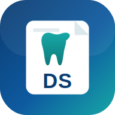

# DentPilot Student — دينت بايلوت للطلاب

### متابِع الحالات السريرية لطلاب كلية الأسنان

تطبيق ويب (PWA) بسيط لتنظيم الحالات السريرية أثناء التدريب الجامعي — يعمل دون إنترنت،
وكل البيانات محلية على جهاز الطالب. منتج مستقل تماماً عن DentPilot Pro.

---

## ✨ المميزات
- **لوحة طالب مبسّطة** بسبعة أزرار.
- **جميع المرضى**: قائمة مرقّمة مدمجة + بحث بالاسم/الهاتف/القسم/نوع الحالة.
- **المرضى حسب الأيام**: تجميع الحالات حسب اليوم السريري المخصّص، مع الفرز حسب وقت الموعد.
- **متطلبات الكلية**: أعداد مطلوبة لكل قسم مع احتساب المكتمل تلقائياً وأشرطة تقدّم.
- **إضافة/تعديل حالة**: القسم، نوع الحالة، السن، اليوم، وقت الموعد، الحالة، الملاحظات.
- **ملف الحالة**: بيانات + جلسات + ملاحظات + مرفقات + طباعة تقرير A4.
- **الجلسات**: رقم تلقائي، تاريخ ويوم الأسبوع، وقت، الإجراء، ملاحظات، موعد قادم، حالة الجلسة.
- **المرفقات**: صور/أشعة/مستندات محلية لكل حالة (تُصغَّر الصور تلقائياً).
- **نسخة احتياطية**: تصدير/استعادة بيانات الطالب فقط.
- **PWA**: قابل للتثبيت، يعمل دون إنترنت، عربي RTL، للجوال أولاً.
- **تفعيل الجهاز**: تفعيل محلي لمرة واحدة، مستقل عن Pro.

## 🗂️ التخزين المحلي (منفصل عن Pro)
- الحالات: `dentpilot_student_cases_v1`
- الإعدادات: `dentpilot_student_settings_v1`
- المتطلبات: `dentpilot_student_requirements_v1`
- التفعيل: `dentpilot_student_activation_v1`
- المرفقات: `dentpilot_student_attachments_v1`

## 🌐 النشر
افتح `index.html`، أو انشره على Netlify/GitHub Pages (يعمل التثبيت والعمل دون إنترنت عبر HTTPS).

## 🔒 الخصوصية
كل البيانات محلية على الجهاز، ولا تُرسَل لأي خادم.

## 📄 الرخصة
MIT — راجع [LICENSE](LICENSE).
